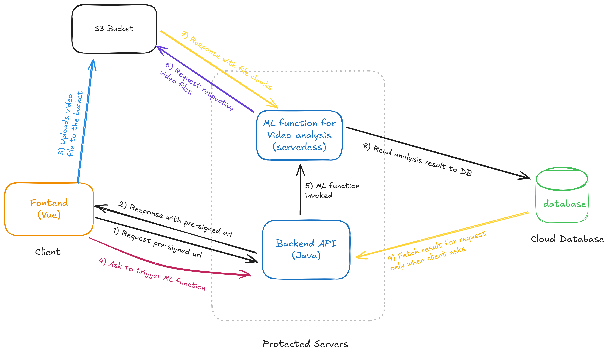
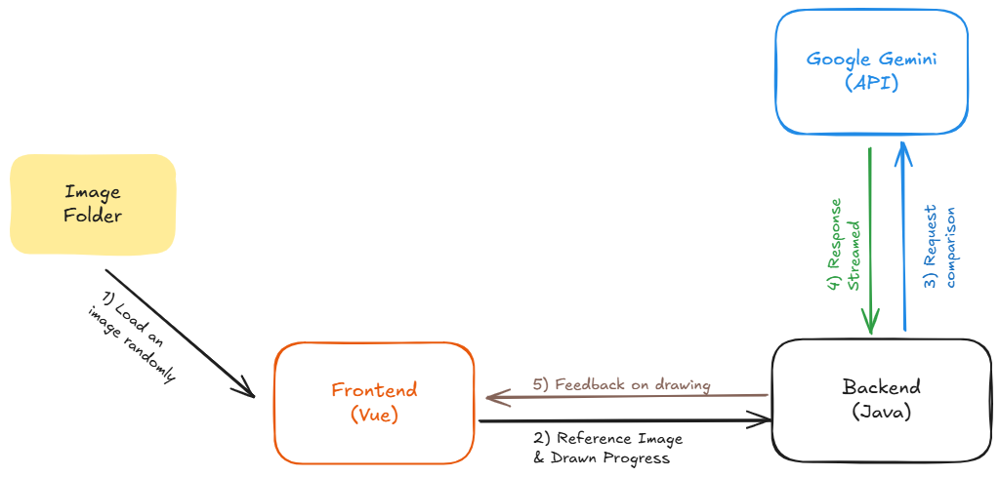

# AutiMate
### Fast and reliable early stage autism screening for kids.


## Run with Docker
```
docker build -t autimate-v1 .
docker run -p 8080:8080 -p 5173:5173 autimate-v1
```


## What `AutiMate` does?
Our app are ment to be used by parents. A parent would answer few questions about child's behavior and upload a single 15-20 sec video clip of the child doing any activity (walking, grabbing objects, arm flipping etc.) and our system would check if child's behavior seemed to be autistic or not. 
<br>
Our behavioral analysis model is a video classifier follows the architecture mentioned in this paper: 
> *Rani, Asha and Verma, Yashaswi* (WACV 2024). **Activity-Based Early Autism Diagnosis Using a Multi-Dataset Supervised Contrastive Learning Approach**. In *Proceedings of the IEEE/CVF Winter Conference on Applications of Computer Vision (WACV)*, January 2024, pp. 7788-7797.


### Technical Details
Our system consists of 4 different micro-services: 
- Backend (Java Spring)
- Behavioral Analysis function - **Serverless** (Python, PyTorch, ONNX)
- Frontend (VueJS)
- Database (Cloud Mongodb)

Behavioral analysis function is a serverless function. The decision influenced by primarily for scaling factor and then cost factor. Because we haven't made the app public yet, we currently don't have a heavy load and serverless is therefore cost effective than renting a dedicated GPU cluster. At the same time, when we will go public, instead of vertically scaling, we can rely on serverless to handle multiple requeset at the same time.

### How our serverless reduces load from backend?
Video classification requires immense resources. Doing it on backend server each time would left the 1 cpu core freeze from serving other requests for the time being. But this is unexpected and cannot be scaled. Therefore, we decided to move our video classification system on serverless system. Here is a complete overview of how it works.

<center><font size="2">Fig 1: Video Classification system</font></center>

### How does feedback system works in therapy?
We tried to make it as real-time as possible. Unfortunately, we cannot afford a faster model (such as claude 3.5 haiku) at that moment and had to go with `gemini-1.5-flash` as it is the free option avilable.
But, we believe that kids at our targeted age are quite slow at drawing and it feels kind of real time at their speed. <br>
<br>The overall procedure is quite simple. We start by randomly choosing a common object's picture. Then ask the child to draw the object.

<table style="width: 100%; border: 0">
  <tr>
    <td style="text-align: center; width: 50%;"><br><font size="2">Fig 2: Sample easy to draw image</font></td>
    <td style="text-align: center; width: 50%;"><br><font size="2">Fig 3: Reference image and drawn image combined to ask feedback from AI</font></td>
  </tr>
</table>


The child's task is to draw something as close to the reference image. When any new stroke or line or shape is added to the canvas, we pair it along with the reference image and send to the backend server to request feedback from AI.
The feedback then converted to sound via `SpeechSynthesisUtterance` API.



<center><font size="2">Fig 4: Drawing feedback system</font></center>


## Reference
```
@InProceedings{Rani_2024_WACV,
    author    = {Rani, Asha and Verma, Yashaswi},
    title     = {Activity-Based Early Autism Diagnosis Using a Multi-Dataset Supervised Contrastive Learning Approach},
    booktitle = {Proceedings of the IEEE/CVF Winter Conference on Applications of Computer Vision (WACV)},
    month     = {January},
    year      = {2024},
    pages     = {7788-7797}
}
```